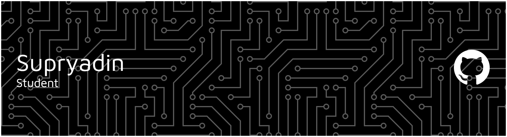

# ✨ Hello, I'm Supryadin ✨

### I'm a student of information systems, and I'm currently studying artificial intelligence (AI).</h3>

---

## 🌐 Socials:

<h3 align="left">Languages and Tools:</h3>

###

  
  
  
  
  
  
  
  
  
  
  
  
  
  
  
  
  

## 📊 GitHub Stats:

###

  

###

  

###
